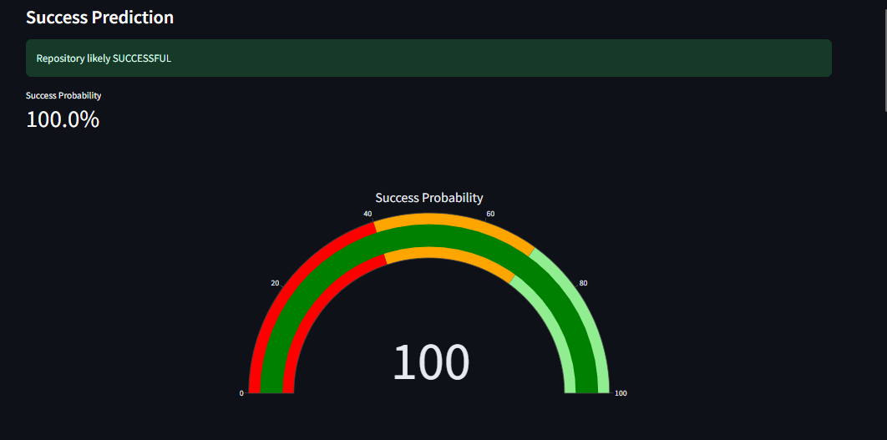
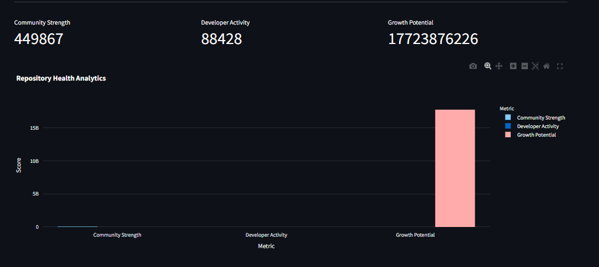

# GitHub AI Repository Analyzer


An AI-powered dashboard that predicts whether a GitHub repository will become successful and analyzes repository health using machine learning and GitHub API data.

Built using **Python, Streamlit, Scikit-Learn, and Plotly**.

---

## Live Demo

Coming Soon (Streamlit Cloud Deployment)

---

## Features

- Predict GitHub repository success using Logistic Regression
- Analyze repositories using GitHub API
- Interactive dashboard with visual analytics
- Success probability gauge
- Repository health analytics
- Community strength score
- Developer activity score
- Growth potential score
- Feature importance visualization
- Model explanation dashboard
- Prediction history tracking
- Download prediction results

---

## Tech Stack

- Python
- Streamlit
- Scikit-Learn
- Plotly
- Pandas
- NumPy
- GitHub REST API

---

## Dataset

The dataset used to train the machine learning model is available on Kaggle.

Download the dataset here:

https://www.kaggle.com/datasets/nikhil25803/github-dataset

⚠️ The dataset is not included in this repository due to its large size.

After downloading, place the dataset in your project folder before running the training notebook.

---

## How It Works

The system analyzes repository metrics such as:

- Forks
- Watchers
- Pull Requests
- Commit Activity
- Community Engagement

These features are processed using:

1. Log Transformation  
2. Feature Scaling  
3. Logistic Regression Model  

The model predicts the probability of repository success.

---

## Example Repository Analysis

Example repository to test:

https://github.com/public-apis/public-apis

The system will:

1. Fetch repository data using GitHub API  
2. Generate metrics automatically  
3. Predict repository success probability  
4. Display analytics dashboard  

---

## Dashboard Preview

### Prediction Dashboard


### Repository Analytics


---

## Installation

Clone the repository:

```bash
git clone https://github.com/Zubair-khan0723/github-ai-repository-analyzer.git
cd github-ai-repository-analyzer
```

Install dependencies:

```bash
pip install -r requirements.txt
```

Run the application:

```bash
streamlit run app.py
```

---

## Project Structure

```
app/
models/
data/
notebooks/
screenshots/
requirements.txt           # Python dependencies
README.md                  # Project documentation
```

---

## Machine Learning Model

Model: **Logistic Regression**

Evaluation metrics:

- Accuracy ≈ 0.83
- ROC-AUC ≈ 0.90

---

## Future Improvements

- SHAP model explainability
- Advanced GitHub repository analytics
- Growth prediction using time-series analysis
- Deployment with Streamlit Cloud
